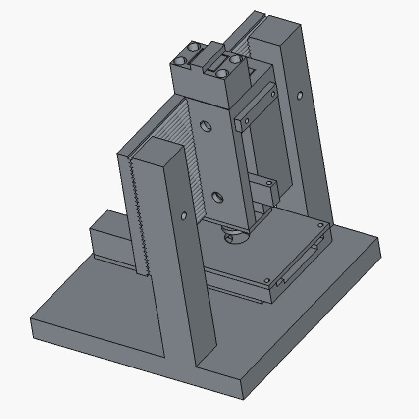
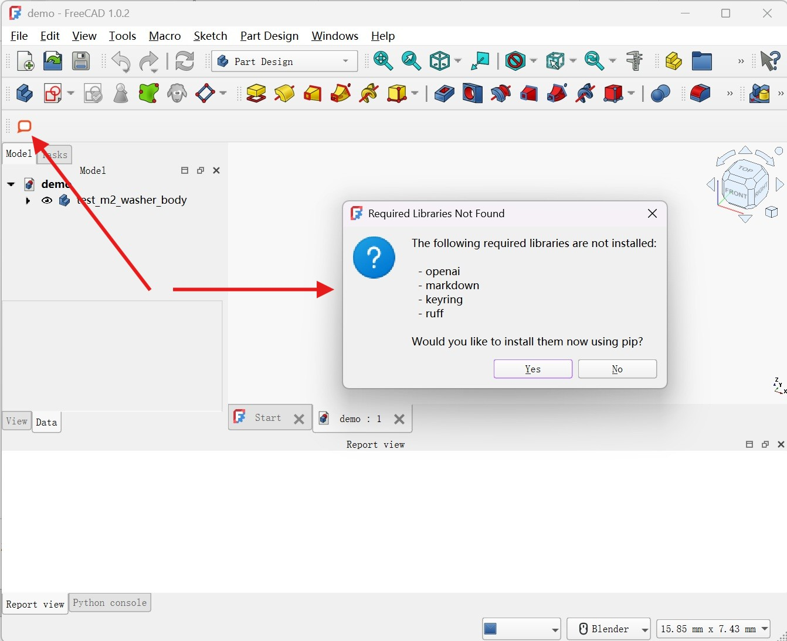
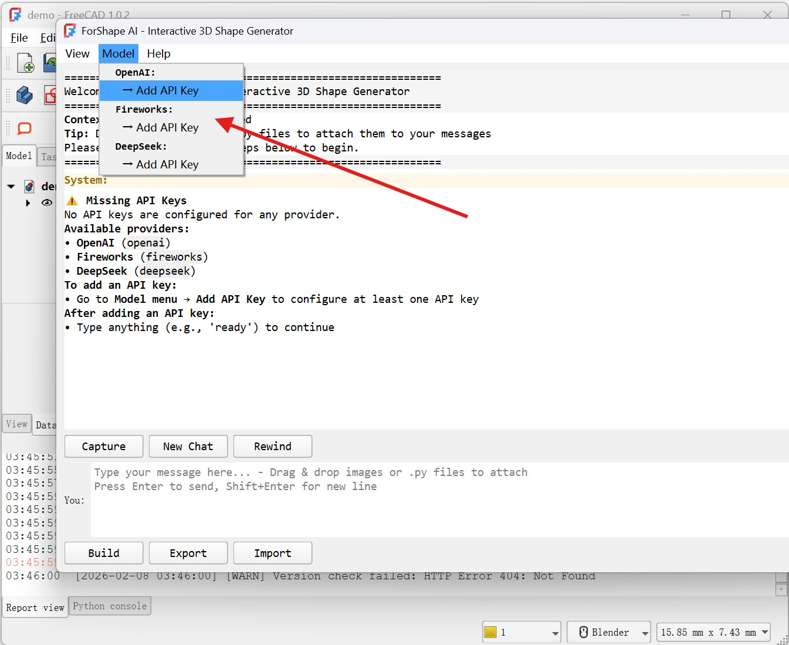
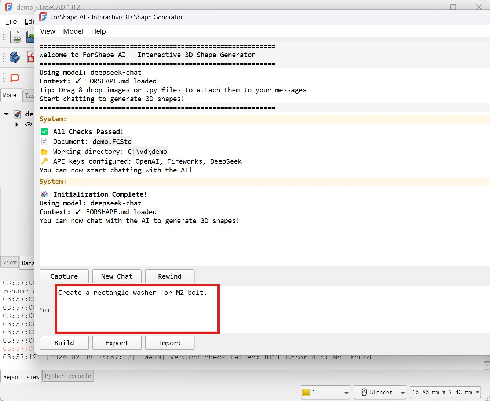
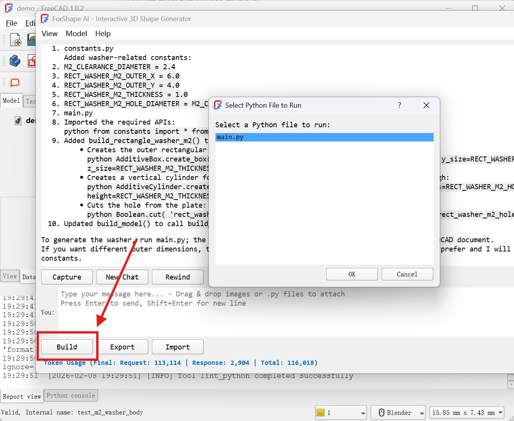
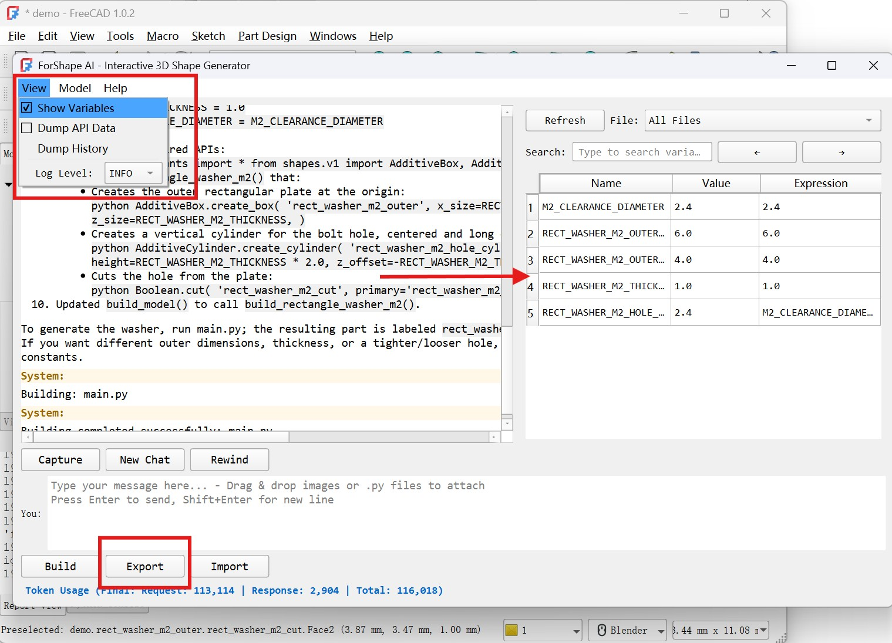

<h1 align="center">ForShape AI </h1>

<p align="center">
  
</p>

ForShape AI is an AI-powered FreeCAD plugin that lets you create and manipulate 3D shapes through natural language.

**Workflow:** User input → AI agent → Python code → 3D parametric design. You describe what you want in natural language, the AI agent translates your description into FreeCAD Python scripts, and FreeCAD executes them to produce parametric 3D models.

## Installation

### Prerequisites

- FreeCAD v1.0.2 or later installed.

### Toolbar Installation

Install ForShape AI as a toolbar button in FreeCAD's Part and PartDesign workbenches.

#### Step 1: Run the install script

In FreeCAD's Python console, run:

```python
script_folder = 'C:/path/to/your/download'; exec(open(f'{script_folder}/install_macro.py').read())
```

Replace `C:/path/to/your/download` with the actual path to the forshape app folder.

#### Step 2: Restart FreeCAD

Close and reopen FreeCAD. A **ForShape AI** toolbar button with an icon  will appear when you switch to the **Part** or **Part Design** workbench.

#### Step 3: Click the toolbar button

Click the ForShape AI button to launch the assistant.

### Reinstallation

If you move the project folder to a new location, re-run the install script with the updated path:

```python
script_folder = 'C:/new/path/to/new/location'; exec(open(f'{script_folder}/install_macro.py').read())
```

Then restart FreeCAD.

## Getting Started

1. To launch the application, click the chat bubble icon . Upon first launch, you will be prompted to install the necessary dependencies.

<p align="center">
  
</p>

2. To use the AI features, please provide your own LLM API key. Navigate to the **Model** menu and select **Add API Key** to configure your credentials.

   *Note: Only one API key from your preferred provider is required.*

<p align="center">
  
</p>

3. Enter your design prompt in the input field and press Enter. The AI agent will assist you in generating parametric 3D models based on your description.

<p align="center">
  
</p>

4. Once the AI agent has generated the necessary scripts, click the **Build** button. FreeCAD will then construct the 3D object based on the generated code.

<p align="center">
  
</p>

5. After building, you may fine-tune your design using the **Variables** view, which displays all parameters and expressions used in generating the 3D object. To save your work, use the **Export** button to export the final model.

<p align="center">
  
</p>

## Development

The best way to get started with development is probably using an AI agent. The agent can read the codebase, understand the project structure, and help you implement features or fix bugs with full context.

### Project Structure


- **`agent/`** — AI agent orchestration: LLM API integration, multi-step workflows, tool execution, chat history, and API key management.
- **`app/`** — GUI and application layer: main window, configuration, UI components, widgets, and background workers.
- **`shapes/`** — FreeCAD shape generation library: parametric primitives, boolean operations, transforms, edge features, and export. See [`shapes/README.md`](shapes/README.md) for the API reference.
